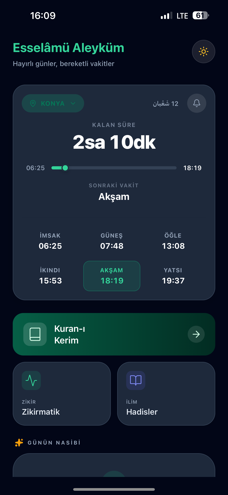
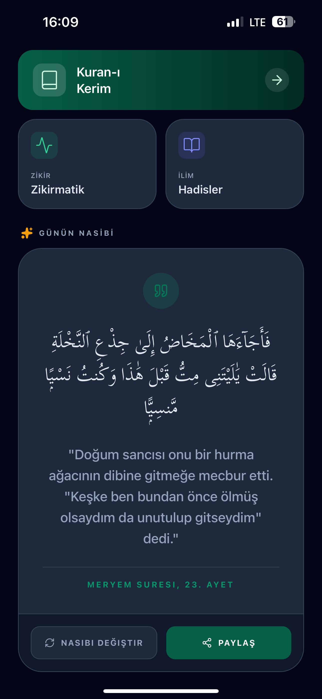
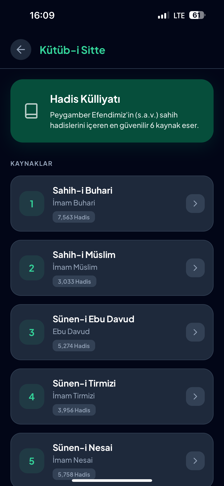
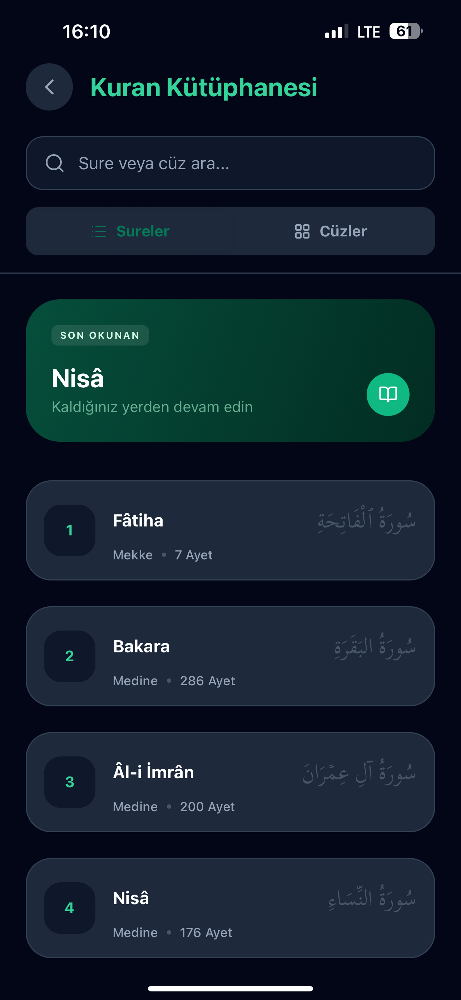
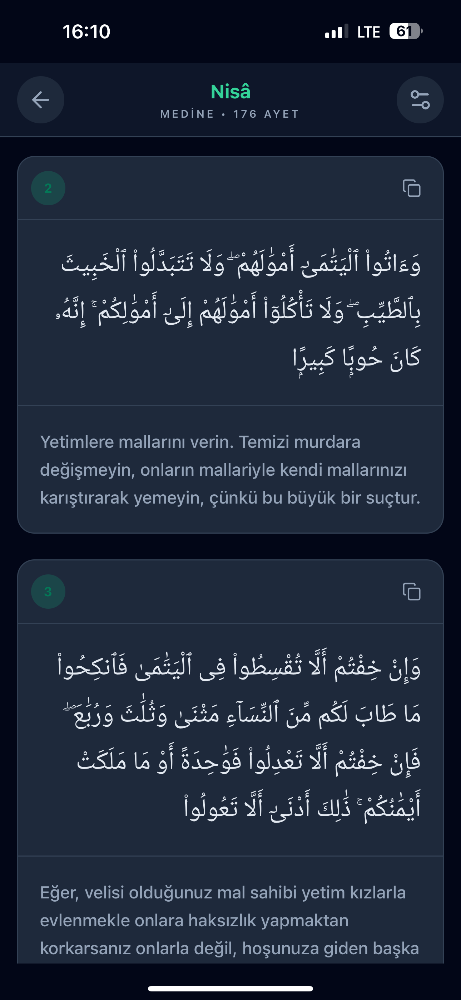
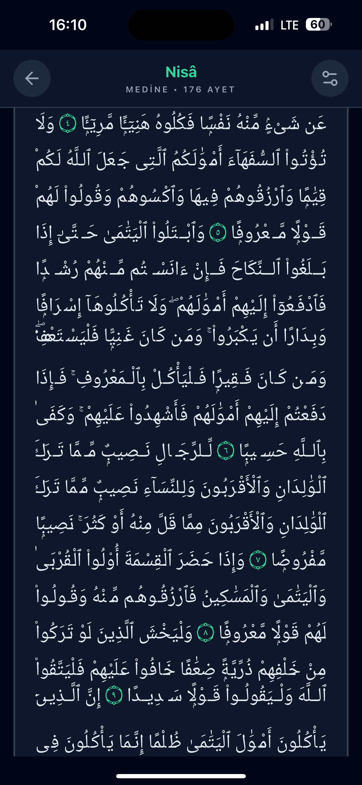

# RuhUp 🌙
### Günlük Manevi Rehberiniz


**RuhUp**, günlük ibadetlerinizi takip etmeniz ve manevi dünyanızı zenginleştirmeniz için tasarlanmış kapsamlı bir İslami yaşam asistanıdır. Modern arayüzü, göz yormayan renk tonları ve kullanıcı dostu özellikleri ile namaz vakitlerinden Kuran-ı Kerim okumaya kadar her an yanınızda.

---

## 📸 Uygulama Görselleri

<div style="display: flex; flex-direction: row; flex-wrap: wrap; justify-content: center; gap: 10px;">
  
  
  
  
  
  
</div>

---

## ✨ Özellikler

### 🌙 Namaz Vakitleri & Geri Sayım
Seçtiğiniz şehir için Diyanet uyumlu namaz vakitlerini anlık olarak takip edin. Şık dairesel geri sayım aracı ile bir sonraki vakte ne kadar kaldığını kolayca görün.

### 📖 Kuran-ı Kerim Okuma
- Sureleri hem **Arapça orijinal hattıyla (Amiri fontu)** hem de **Türkçe mealiyle** okuyun.
- Göz yormayan okuma modu ile dikkatiniz dağılmadan ibadetinize odaklanın.

### 📿 Akıllı Zikirmatik
- **Hazır Zikirler**: Sübhanallah, Elhamdülillah gibi hazır paketleri kullanın.
- **Serbest Mod**: Kendi zikirlerinizi çekin.
- **Titreşim Geri Bildirimi**: Ekrana bakmanıza gerek kalmadan zikir çekmenin rahatlığını yaşayın.

### ✨ Esma-ül Hüsna
Allah'ın 99 güzel ismini, Arapça yazılışları ve derin manalarıyla birlikte keşfedin.

### 📜 Hadis-i Şerif Kütüphanesi
Buhari, Müslim, Tirmizi gibi güvenilir kaynaklardan derlenmiş hadislerle ilminizi artırın.

### 🌟 Günün Nasibi (Tevafuk)
Uygulamayı her açtığınızda size özel rastgele gelen bir Ayet veya Hadis ile güne manevi bir mesajla başlayın.

---

## 🛠 Teknolojiler

Bu proje aşağıdaki teknolojiler kullanılarak geliştirilmiştir:
- **React Native** & **Expo**: Cross-platform mobil uygulama geliştirme.
- **NativeWind (Tailwind CSS)**: Hızlı ve modern stillendirme.
- **TypeScript**: Tip güvenli kod geliştirme.
- **Lucide React Native**: Modern ikon seti.

---

## 🚀 Kurulum

Projeyi yerel makinenizde çalıştırmak için aşağıdaki adımları izleyin:

1. **Repoyu klonlayın:**
   ```bash
   git clone https://github.com/kullaniciadi/ruhup.git
   cd ruhup
   ```

2. **Bağımlılıkları yükleyin:**
   ```bash
   npm install
   ```

3. **Uygulamayı başlatın:**
   ```bash
   npx expo start
   ```

4. **Çalıştırın:**
   - **iOS:** `i` tuşuna basın (Xcode simülatör gerektirir).
   - **Android:** `a` tuşuna basın (Android Studio emülatör gerektirir).
   - **Telefon:** Expo Go uygulamasını indirip QR kodu taratın.

---
## 🤝 İletişim

Geliştirici: **Mehmet Taha Uyar**
Proje ile ilgili geri bildirimleriniz için iletişime geçebilirsiniz.

---
*RuhUp - Maneviyatınızı cebinizde taşıyın.*
